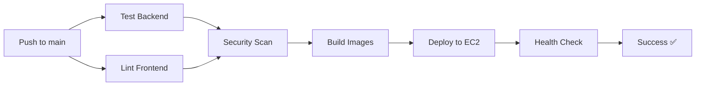

# CI/CD Setup Complete ✅

## 🎉 What's Been Implemented

### 1. **Docker Infrastructure**
- ✅ `Dockerfile.backend` - FastAPI backend containerization
- ✅ `Dockerfile.web` - React frontend with Nginx
- ✅ `docker-compose.prod.yml` - Production orchestration
- ✅ `nginx.conf` - Reverse proxy configuration
- ✅ `.dockerignore` - Optimized build context

### 2. **GitHub Actions Workflow**
- ✅ `.github/workflows/deploy.yml` - Full CI/CD pipeline
- ✅ Automated testing (backend + frontend)
- ✅ Security scanning with Trivy
- ✅ Docker image building
- ✅ EC2 deployment automation
- ✅ Health check validation

### 3. **Deployment Scripts**
- ✅ `scripts/setup-ec2.sh` - One-time EC2 setup
- ✅ `scripts/local-deploy.sh` - Local testing script
- ✅ `DEPLOYMENT.md` - Comprehensive deployment guide

### 4. **Configuration**
- ✅ `.env.example` - Environment template
- ✅ Backend CORS from environment variables
- ✅ Enhanced health check endpoint

## 📋 Required GitHub Secrets

Configure these in: `Settings → Secrets and variables → Actions`

| Secret Name | Value | Notes |
|------------|-------|-------|
| `EC2_SSH_KEY` | Your private SSH key | Full key including headers |
| `EC2_USER` | `ubuntu` | Or `ec2-user` for Amazon Linux |
| `PROJECT_DIR` | `/srv/vogo` | Optional, defaults to this |
| `OPENAI_API_KEY` | Your OpenAI API key | Required for LLM features |

## 🚀 How to Deploy

### First Time Setup

1. **Setup EC2 Instance**
   ```bash
   ssh ubuntu@18.170.49.10
   bash < /dev/stdin < scripts/setup-ec2.sh
   ```

2. **Configure GitHub Secrets**
   - Add SSH key: `cat ~/.ssh/id_rsa` → Copy to `EC2_SSH_KEY`
   - Add OpenAI key to `OPENAI_API_KEY`

3. **Deploy**
   ```bash
   git add .
   git commit -m "Setup CI/CD"
   git push origin main
   ```

### Automatic Deployments

Every push to `main` branch automatically:
1. ✅ Runs tests
2. ✅ Builds Docker images
3. ✅ Deploys to EC2
4. ✅ Runs health checks
5. ✅ Validates deployment

### Manual Deployment

Go to `Actions` tab → `CI/CD – Vogo` → `Run workflow`

## 🔍 Workflow Pipeline



### Pipeline Stages

1. **Test** (parallel)
   - Backend: pytest with coverage
   - Frontend: ESLint validation

2. **Security Scan** (main only)
   - Trivy vulnerability scanning
   - SARIF report upload to GitHub

3. **Build**
   - Docker build validation
   - Compose config check

4. **Deploy** (main only)
   - File transfer via rsync
   - Docker Compose deployment
   - Database migrations
   - Service health checks

5. **Validate**
   - API health endpoint
   - Web interface check
   - Service status verification

## 🌐 Access Your Application

After deployment:

- **Web Interface**: http://18.170.49.10/
- **API Documentation**: http://18.170.49.10/docs
- **Health Check**: http://18.170.49.10/healthz

## 📊 Monitoring

### View Deployment Status
```bash
# Check GitHub Actions
https://github.com/YOUR_USERNAME/vogo/actions

# SSH to EC2
ssh ubuntu@18.170.49.10

# View logs
cd /srv/vogo
docker compose -f docker-compose.prod.yml logs -f

# Check status
docker compose -f docker-compose.prod.yml ps
```

### Health Checks

```bash
# API health
curl http://18.170.49.10/healthz

# Service status
curl http://18.170.49.10/docs

# Check from EC2
ssh ubuntu@18.170.49.10 'docker ps'
```

## 🛠️ Maintenance

### Update Dependencies

```bash
# Backend
cd backend
pip install --upgrade <package>
pip freeze > requirements.txt

# Frontend
cd web
npm update
npm audit fix
```

### Database Migrations

```bash
# Create migration
ssh ubuntu@18.170.49.10
cd /srv/vogo
docker exec $(docker ps -qf "name=api") alembic revision --autogenerate -m "description"

# Apply migration (auto on deploy)
docker exec $(docker ps -qf "name=api") alembic upgrade head
```

### Rollback

```bash
# From EC2
cd /srv/vogo
git checkout <previous-commit>
docker compose -f docker-compose.prod.yml up -d --build
```

## 🔐 Security Features

✅ Non-root container users  
✅ Minimal base images (Alpine)  
✅ Multi-stage builds  
✅ Secret management via GitHub  
✅ HTTPS-ready nginx config  
✅ Health check monitoring  
✅ Automated security scanning  

## 🚨 Troubleshooting

### Deployment Fails

1. Check GitHub Actions logs
2. SSH to EC2: `ssh ubuntu@18.170.49.10`
3. View container logs: `docker compose logs`
4. Check `.env` file exists and is valid

### Health Check Fails

```bash
# On EC2
curl localhost/healthz

# Check API directly
docker exec $(docker ps -qf "name=api") curl localhost:8000/healthz

# Restart services
docker compose -f docker-compose.prod.yml restart
```

### Database Issues

```bash
# Check DB status
docker exec $(docker ps -qf "name=db") pg_isready -U vogo

# View DB logs
docker compose -f docker-compose.prod.yml logs db

# Reset database (CAUTION: data loss)
docker compose -f docker-compose.prod.yml down -v
docker compose -f docker-compose.prod.yml up -d
```

## 📚 Additional Resources

- [DEPLOYMENT.md](DEPLOYMENT.md) - Detailed deployment guide
- [GETTING_STARTED.md](GETTING_STARTED.md) - Local development setup
- [GitHub Actions Docs](https://docs.github.com/en/actions)
- [Docker Compose Docs](https://docs.docker.com/compose/)

## ✨ Next Steps

1. ✅ Configure GitHub Secrets
2. ✅ Run initial deployment
3. ✅ Verify health checks pass
4. 🔄 Setup domain name (optional)
5. 🔒 Add SSL certificate (optional)
6. 📧 Setup monitoring/alerts (optional)

---

**Status**: http://18.170.49.10/healthz  
**Deployment Target**: EC2 @ 18.170.49.10  
**Auto-Deploy**: Enabled on `main` branch

